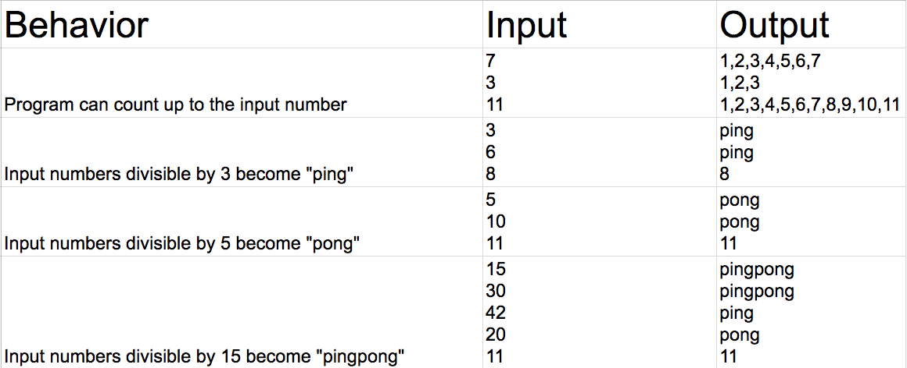

# _Ping Pong Converter_

#### _Intro to Programming Independent Project for Epicodus - 24 February 2017_

#### By _**Dallas Slaughter (slaughtr)**_

## Description
A webpage (using HTML, CSS, Bootstrap, JavaScript, and jQuery) that asks users to input a number that is then counted up to starting at 1 and that count is converted into a list, translating certain values to ping, pong, or pingpong. If the number is divisible by 3, it becomes "ping". If it is divisible by 5, it becomes "pong". If divisible by both 3 and 5, it becomes "pingpong".

## Setup/Installation Requirements
1. Clone this repository onto your desktop. This will place the all files and folders in onto your computer.

2. Click on the index.html file in the browser. This will allow you to view the file in your browser. If this does not open in your browser, navigate to project folder via your command line and type "open index.html".

## Specifications

## Technology Used To Create Portfolio
HTML, CSS, JavaScript, and jQuery.

## License
*GPL*
Copyright (c) 2017 **_Dallas Slaughter_**
